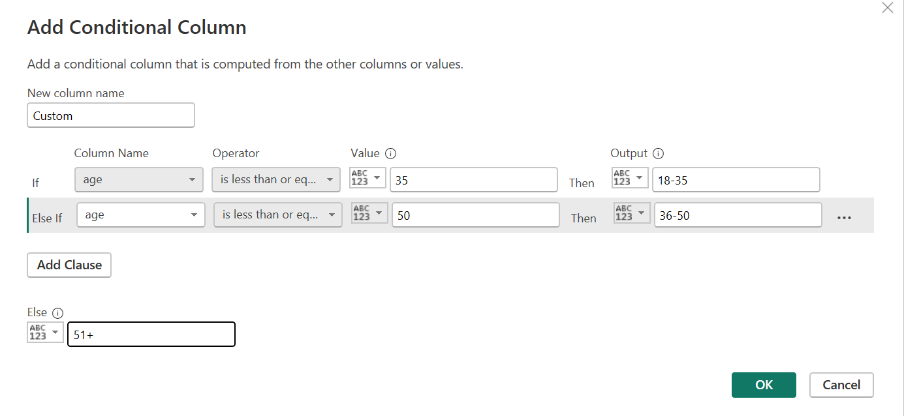
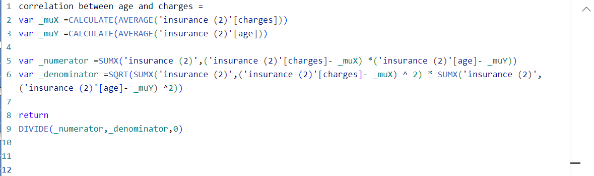
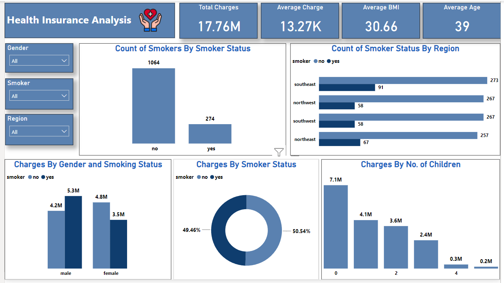
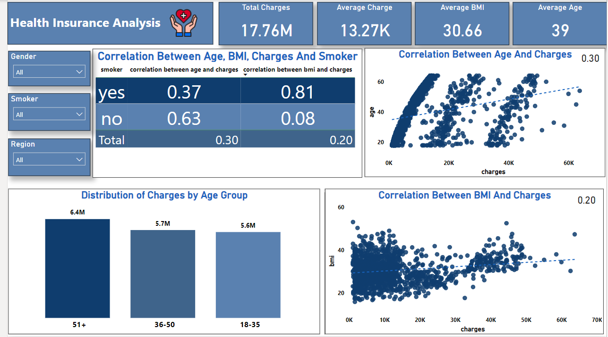

# Health Insurance Analysis

## Introduction

The insurance dataset represents a diverse demographic of policyholders, encompassing key variables such as age, sex, BMI, children, smoker, region, and charges. 
The objective of this analysis is to uncover patterns and relationships within the data to inform strategic decision-making for the insurance company. By examining the interplay of these variables, my team and I aim to provide actionable insights that contribute to the refinement insurance products and pricing strategies.

**_Disclaimer_** : _All datasets and reports do not represent any company, institution or country, this is just a dumy dataset to demonstrate the capabilities of PowerBI._

## Skills Demonstrated

- DAX
- Quick Measures
- Data Transformation
- Visualization
- Team Work

## Data Transformation

Conducted a thorough examination of the dataset to identify and address missing values, outliers, and any inconsistencies. A new column was created for the Age group to help categorize age ranges (18-35years,36-50years,51years+).

## DAX Functions
Utilized DAX measures to conduct a statistical analysis, computing correlation coefficients to explore relationships between age, BMI, and charges. The correlation coefficients provide insights into the strength and direction of linear associations among these variables, contributing to a deeper understanding of their interdependencies within the dataset.

Correlation between Age and Charges  |    Correlation between BMI and Charges
:-----------------------------------:|:-------------------------------------:
                       | 

## Visualizations

The report contains two pages. We utilized various visualization techniques, including charts and graphs, to communicate insights effectively to stakeholders. This short [video]( https://youtu.be/P7hvHrLNZvQ) showcases the interactive features of our Power BI report.

## Insights

- Key Performance Indicators (KPIs):
  According to our findings, the average age of individuals which reflects the demographic composition of the insured population in the dataset is 39years, average Body Mass Index (BMI) is 30.66, indicating a distribution of individuals across various weight categories. Also, total charges incurred by policy holders amount to $17.76 million, representing the aggregate financial impact on the insurance system as opposed to $13,270.42 as the average charge incurred by policy holders.

- Smokers Vs Non-Smokers:
  From our analysis we gathered that non-smokers have a higher count in our dataset as compared to actual smokers.

- Regional Analysis: 
The Southeast region stands out with 91 and 273 as highest number of both smokers and non-smokers respectively. This regional disparity warrants deeper exploration into regional health trends and potential influencing factors.

- Comparison of Charges:
Our analysis reveals that non-smokers incur 50.54% of the charges as opposed to 49.46% incurred by smokers. This finding prompts further investigation into the factors which may include non-smokers having some underlaying health conditions that may be contributing to this observed difference. A gender-specific breakdown reveals that male smokers incur higher charges than female smokers. The distinction may be influenced by gender-specific health patterns or other underlying factors. Also, individuals with fewer children tend to incur higher charges compared to those with a greater number of children. This finding raises questions about the correlation between family size and healthcare utilization.

- Correlation Between Age and Charges/Correlation Between BMI and Charges:
The total correlation between age and charges coefficient is 0.30, indicating a weak positive linear relationship. This suggests that, on average, as age increases, there is a tendency for charges to also increase, though the relationship is not very strong. On the other hand, the total correlation coefficient is 0.20, indicating a weak positive linear relationship between BMI and charges. As BMI increases, there is a tendency for charges to increase, but the influence is minimal.
Non-smokers - Correlation between age and charges is 0.63, suggesting a moderately strong positive relationship whilst correlation between BMI and charges is 0.08, indicating a very weak positive relationship.
Smokers - Correlation between age and charges is 0.37, suggesting a moderate positive relationship whilst correlation between BMI and charges is 0.81, indicating a strong positive relationship. While age and BMI show some correlation with charges, it's essential to recognize that correlation does not imply causation.

- Age Group Analysis: The analysis focuses on categorizing age groups into age ranges to understand the relationship between age and charges. Individuals aged 51 and above (51+) contribute to a substantial portion of the overall charges, age group 36-50 follows with the second-highest average charges and individuals between 18-35 age group exhibit the lowest average charges. The observed trend suggests a positive correlation between age and healthcare costs within the dataset.

## RECCOMENDATIONS
1.Introduce customer education campaigns to raise awareness about the impact of lifestyle factors on insurance costs. Informed policyholders may make healthier choices, leading to better risk profiles and potential cost savings for both the insured and the insurance company.

2.Consider developing insurance products specifically designed for different demographic segments. Tailored products could address the unique risk profiles associated with age, smoking status, and other relevant variables, providing customers with more personalized coverage options.

3.Introduce incentive programs to encourage policyholders to adopt healthier lifestyles, especially those related to smoking cessation and BMI management. These initiatives could lead to reduced overall healthcare costs and improved long-term risk profiles.

4.Establish a robust data analytics framework for continuous monitoring and analysis. Regularly review and update risk models based on evolving trends and emerging insights, ensuring that pricing strategies remain responsive to changing market dynamics.

## CONCLUSION
In conclusion, further exploration is needed to understand the factors contributing to the correlations between data variables. This could involve investigating specific health conditions, lifestyle factors, or medical treatments associated with policy holders.
Additional analyses, such as regression modeling, may help uncover more nuanced relationships and potential causal factors.

 ### Team 😄 from TECH4DEV on this project included :
- ### Barbara Addo, Ghana.
- ### Rita Avwenagbiku, Nigeria.
- ### Lillian Mutinda, Kenya.

  

  
