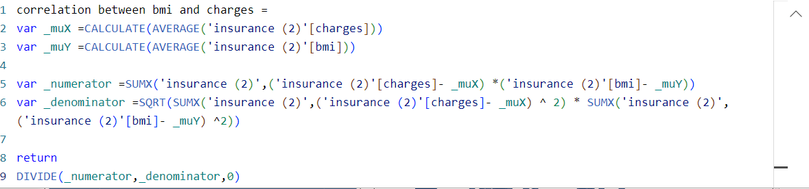

# Health Insurance Analysis

## Introduction

The insurance dataset represents a diverse demographic of policyholders, encompassing key variables such as age, sex, BMI, children, smoker, region, and charges. 
The objective of this analysis is to uncover patterns and relationships within the data to inform strategic decision-making for the insurance company. By examining the interplay of these variables, my team and I aim to provide actionable insights that contribute to the refinement insurance products and pricing strategies.

**_Disclaimer_** : _All datasets and reports do not represent any company, institution or country, this is just a dumy dataset to demonstrate the capabilities of PowerBI._

## Skills Demonstrated

- DAX
- Quick Measures
- Data Transformation
- Visualization

## Data Transformation

Conducted a thorough examination of the dataset to identify and address missing values, outliers, and any inconsistencies. A new column was created for the Age group to help categorize age ranges (18-35years,36-50years,51years+).

## DAX Functions
Utilized DAX measures to conduct a statistical analysis, computing correlation coefficients to explore relationships between age, BMI, and charges. The correlation coefficients provide insights into the strength and direction of linear associations among these variables, contributing to a deeper understanding of their interdependencies within the dataset.

Correlation between Age and Charges  |    Correlation between BMI and Charges
:-----------------------------------:|:-------------------------------------:
                       | 

## Visualizations
The report contains two pages. We utilized various visualization techniques, including charts and graphs, to communicate insights effectively to stakeholders.

  
